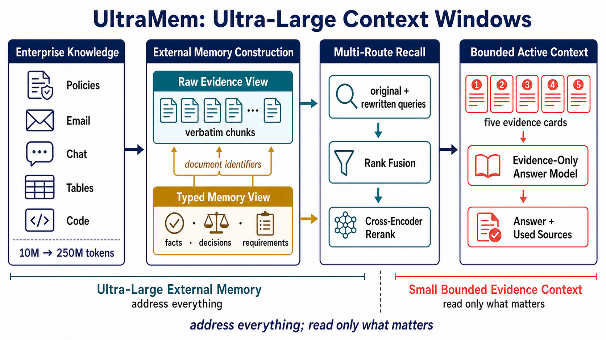

# Scaling Agent Context Beyond the Prompt

**ULMCW-Bench: provenance-preserving dual-view memory for corpora up to 250 million tokens**

<p align="center">
  <a href="https://github.com/Hik289/large-context-window/actions/workflows/ci.yml"></a>
  
  <a href="LICENSE"></a>
  <a href="CITATION.cff"></a>
</p>

ULMCW-Bench studies how an agent can use a persistent document collection that is
orders of magnitude larger than its prompt. The system stores every source in two
linked forms: compact, typed memories for inexpensive semantic access and verbatim
evidence for recall, grounding, and audit. At query time it retrieves across both
views, fuses and reranks candidates, packs a bounded working context, and retains
source provenance through answer generation.

<p align="center">
  
</p>

## Main Findings

| Finding | Evidence |
| --- | --- |
| Strong 10M-token result | **78.29 Overall** versus **68.22** for the public EnterpriseRAG-Bench reference |
| Four of five comparisons improve | Correctness, completeness, document recall, and Overall improve; invalid-document burden remains worse |
| Representation is load-bearing | Removing dual indexing costs **14.73** points; removing distillation costs **11.64** |
| Scale failure is retrieval-driven | From 20M to 250M tokens, correctness is nearly flat with gold documents but falls by 10.5–14.0 points with retrieved evidence |
| Context savings persist across scale | Mixed detailed/distilled packing uses approximately **3.2× fewer tokens** than full-detail packing at both 10M and 20M |

The result is not a claim that retrieval is solved at 250M tokens. The scale study
isolates the remaining bottleneck: evidence discovery degrades with corpus size even
when the reader remains capable of answering from the correct documents.

## Method

The artifact implements a six-stage memory pipeline:

1. **Typed memory construction** converts source chunks into compact definitions,
   requirements, procedures, decisions, constraints, and factual relations.
2. **Dual indexing** keeps distilled memories and verbatim evidence in separate,
   source-linked retrieval surfaces.
3. **Query expansion** generates complementary retrieval cues to reduce vocabulary
   mismatch.
4. **Rank fusion and reranking** combine both views while controlling candidate noise.
5. **Budgeted packing** selects a mixed detailed/distilled context under an explicit
   token budget.
6. **Citation extraction** retains only the sources used by the generated answer.

The installable method primitives live in
[`src/agent_memory/methods/`](src/agent_memory/methods/). The broader
[`src/agent_memory/`](src/agent_memory/) package contains storage, document processing,
retrieval, and inspection utilities.

## Installation

```bash
git clone git@github.com:Hik289/large-context-window.git
cd large-context-window

python -m venv .venv
source .venv/bin/activate
python -m pip install --upgrade pip
pip install -e ".[dev]"
```

Install only the capabilities needed for a run:

```bash
pip install -e ".[retrieval,llm]"                 # dual indexes and model calls
pip install -e ".[documents]"                     # PDF, Office, and Markdown ingestion
pip install -e ".[evaluation,figures]"             # metrics and publication plots
pip install -r requirements.txt                    # complete research environment
```

## Five-Minute Verification

The following checks require no private corpus and no model credential:

```bash
agent-memory --version
pytest
python -m agent_memory.methods.dual_node
python -m agent_memory.methods.token_ledger
python -m agent_memory.methods.configs.isolation
```

A minimal representation-level example:

```python
from agent_memory.methods import DualNode, TokenLedger, validate_one

node = DualNode(
    node_id="policy-17",
    level="L0",
    distilled_text="Travel requests require manager approval.",
    detailed_text="Section 4.2: all international travel requests require manager approval.",
    distilled_tokens=7,
    detailed_tokens=14,
    source_evidence_ids=["handbook:4.2"],
)
assert validate_one(node) == []

ledger = TokenLedger(run_id="demo", method="dual-view")
ledger.record("retrieval", "local", input_tokens=7, output_tokens=0, wall_seconds=0.01)
print(ledger.grand_total())
```

## Configuration

Copy the public templates and provide only the endpoints you use:

```bash
cp .env.example .env
cp configs/models.example.yaml configs/models.yaml
```

The model resolver fails on missing aliases or unresolved providers; it never silently
substitutes a different model family. Real `.env` files, model outputs, corpora,
manifests, and generated indexes are ignored by Git.

## Reproducing the Artifact

| Reproduction level | Included here | Command or guide |
| --- | --- | --- |
| Package and method checks | Yes | `pytest` |
| Dual-view schema and provenance checks | Yes | `python -m agent_memory.methods.dual_node` |
| Token-accounting checks | Yes | `python -m agent_memory.methods.token_ledger` |
| Final aggregate plots | Yes | `python figures/make_all_figs.py` |
| Full benchmark replay | Requires an authorized corpus and model endpoints | [Reproducibility guide](docs/REPRODUCIBILITY.md) |

The plotting scripts contain the aggregate values used by the manuscript. They
reproduce the reported visualizations but do not replace the private or licensed raw
benchmark data. The EnterpriseRAG evaluation adapter under `scripts/eval/` also expects
the official benchmark evaluation package; its dependency boundary is documented
locally.

## Result Summary

### Pure-mini Scaling

| Persistent corpus | Overall | Document recall | Correctness |
| ---: | ---: | ---: | ---: |
| 10M tokens | 70.64 | 84.00 | 82.50 |
| 20M tokens | 71.67 | 84.00 | 84.00 |
| 60M tokens | 64.19 | 78.36 | 78.25 |
| 100M tokens | 63.17 | 75.23 | 77.00 |
| 150M tokens | 60.49 | 72.16 | 75.75 |
| 250M tokens | 58.02 | 66.79 | 73.50 |

### Component Ablation

| Configuration | Combined quality | Change from full |
| --- | ---: | ---: |
| Full dual-view system | 82.26 | — |
| Without query expansion | 79.34 | −2.92 |
| Without reranking | 78.17 | −4.09 |
| Without distillation | 70.62 | −11.64 |
| Without dual indexing | 67.53 | −14.73 |

Protocol definitions, cross-scale controls, external probes, and disclosure notes are
summarized in [Results and evaluation](docs/RESULTS.md).

## Repository Map

```text
large-context-window/
├── src/agent_memory/
│   ├── methods/            # dual nodes, dual index, construction, token ledger
│   ├── document_eval/      # chunking, extraction, retrieval, answering, metrics
│   ├── retriever/          # semantic, hybrid, planning, and reformulation retrieval
│   ├── builder/            # document, chat, and email memory builders
│   ├── processors/         # text, PDF, Word, PowerPoint, Excel, and Markdown
│   ├── core/               # memory entries, stores, filters, and planners
│   └── db_clients/         # ChromaDB and Redis adapters
├── scripts/
│   ├── eval/               # official-benchmark evaluation adapter
│   └── external/           # LoCoMo, LongMemEval, and optional baseline adapters
├── figures/                # deterministic aggregate plotting scripts
├── configs/                # public model-routing templates
├── tests/                  # credential-free method and package tests
└── docs/                   # artifact, result, and reproduction contracts
```

## Scope and Limitations

- The repository does not distribute enterprise corpora, licensed benchmark data,
  generated indices, raw model outputs, or credentials.
- The headline and pure-mini scaling tables use different recorded model protocols and
  are not pooled into one comparison.
- External probes use a local embedding model under a separate protocol.
- Invalid-document burden is worse than the public reference and remains an open
  provenance-quality problem.
- Full large-scale construction is expensive: the recorded 250M-token build required
  multiple days. Start with the credential-free checks and a small authorized corpus.

## Citation

```bibtex
@misc{ulmcwbench2026,
  title  = {Scaling Agent Context Beyond the Prompt:
            Provenance-Preserving Dual-View Memory at 250 Million Tokens},
  author = {Anonymous Authors},
  year   = {2026},
  note   = {Code and research artifact},
  url    = {https://github.com/Hik289/large-context-window}
}
```

## License

The code is released under the [MIT License](LICENSE). External datasets and baseline
implementations retain their own licenses and terms.
