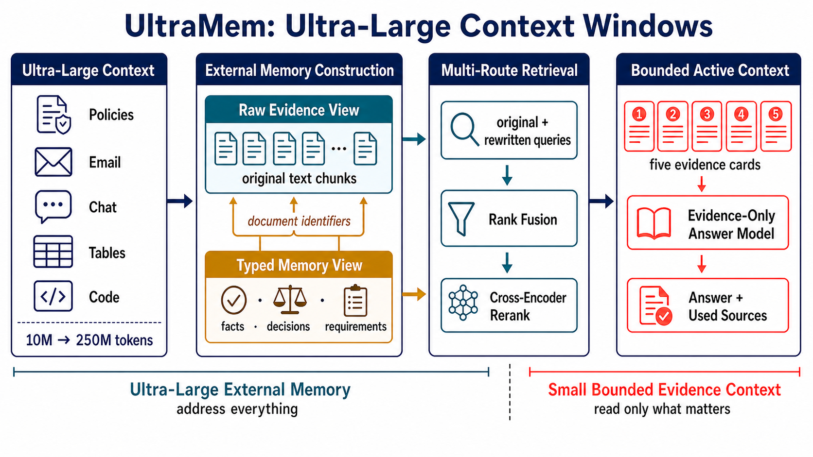
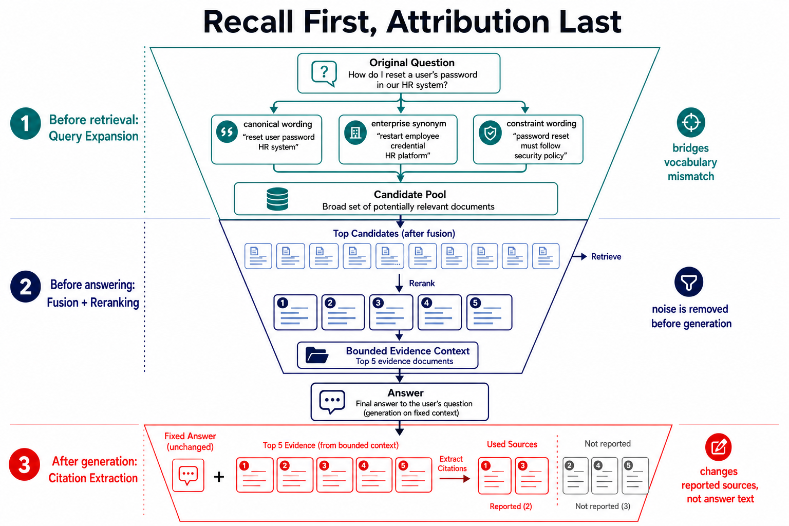

# UltraMem: Ultra-Large Memory Context Windows

**Source-resolved retrieval for persistent memory beyond the prompt**

<p align="center">
  <a href="LICENSE"></a>
  <a href="pyproject.toml"></a>
</p>

UltraMem is a Python package and reference implementation for agents that must search
persistent collections too large for one prompt. It turns an external store containing
10M to 250M tokens into a bounded, source-grounded evidence context. Compact records
retrieve broadly, immutable identifiers resolve every hit to authoritative text, and
only selected evidence reaches the answer model.

<p align="center">
  
</p>

<p align="center"><em>UltraMem keeps the complete collection addressable through raw-evidence and typed-memory views, then resolves multi-route retrieval to a small set of source-faithful evidence cards for answering.</em></p>

## Recall First, Attribution Last

<p align="center">
  
</p>

<p align="center"><em>Query expansion broadens candidate recall; fusion and reranking remove noise before generation; post-answer attribution narrows the reported sources after the answer is fixed.</em></p>

## What UltraMem Does

- **Dual-view memory.** Each `DualNode` pairs a compact retrieval representation with
  detailed source evidence and stable provenance identifiers.
- **Source-resolved generation.** Distilled hits are mapped back to authoritative text
  before reranking, packing, and answer generation.
- **Bounded active context.** Candidate depth and answer-context size are independent,
  allowing persistent memory to grow without expanding every prompt.
- **Auditable execution.** Model aliases, representation checks, source identifiers,
  and per-stage token ledgers make runs inspectable.
- **Provider-neutral configuration.** Model calls use a general
  chat-completions-compatible endpoint; credentials remain in environment variables.

## Architecture

| Stage | Input | Output | Contract |
| --- | --- | --- | --- |
| Build | Authorized source spans | Distilled and detailed views | Preserve source identifiers |
| Recall | Original and rewritten queries | Multi-route candidates | Search both views |
| Resolve | Distilled candidates | Authoritative source text | Never answer from a summary alone |
| Select | Source-text candidates | Ranked evidence set | Fuse, deduplicate, and rerank |
| Pack | Ranked evidence | Bounded active context | Enforce an explicit token budget |
| Answer | Loaded evidence | Answer and used sources | Attribute without rewriting the answer |

The key distinction is between **addressable memory** and **active context**. The former
can span 10M to 250M tokens; the latter remains a small, inspectable evidence budget for
one query.

## Reported Results

The accompanying evaluation measures answer quality, evidence efficiency, and scaling
under fixed active-context budgets. Raw corpora and model outputs are not redistributed;
the public package exposes the contracts and accounting needed to reproduce authorized
runs.

| Evaluation | UltraMem | Reference | Observed difference |
| --- | ---: | ---: | ---: |
| 10M end-to-end combined score | 82.26 | 68.22 published reference | +14.04 pp |
| 10M selective evidence | 2,049 tok/query | 6,532 detailed-only | -68.6% tokens; -1.50 pp correctness |
| 20M selective evidence | 2,025 tok/query | 6,497 detailed-only | -68.8% tokens; -1.50 pp correctness |

With the same bounded query budget, the 250M stress test reports 58.02 combined score
and 73.50% correctness. The scaling trace shows that retrieval coverage, rather than
prompt expansion, becomes the principal bottleneck at the largest tiers. Protocol notes
and the full reporting boundary are documented in [Evaluation](docs/RESULTS.md).

## Installation

UltraMem requires Python 3.11 or newer.

```bash
git clone https://github.com/Hik289/UltraMem.git
cd UltraMem

python -m venv .venv
source .venv/bin/activate
python -m pip install --upgrade pip
pip install -e .
```

The core installation provides the dual-view data contracts, token ledger, CLI, and
remote client without loading a vector database or model runtime. Add only the capability
groups needed for a deployment:

```bash
pip install -e ".[retrieval,llm,documents]"  # complete local memory pipeline
pip install -e ".[local-models]"             # optional local model execution
pip install -e ".[evaluation,figures]"       # evaluation and publication figures
pip install -e ".[dev]"                      # tests and package build tools
```

## Quick Start

The zero-credential example validates the representation and provenance contracts:

```bash
python examples/minimal_contract.py
```

The same primitives are available from the package root:

```python
from ultramem import DualNode, TokenLedger, validate_batch

node = DualNode(
    node_id="policy:001",
    level="L0",
    distilled_text="Travel reimbursement policy and approval rules.",
    detailed_text="Employees must submit receipts within 30 days of travel.",
    distilled_tokens=7,
    detailed_tokens=10,
    source_evidence_ids=["policy:001#section-4"],
)

report = validate_batch([node])
assert report["overall_pass"]

ledger = TokenLedger(run_id="demo", method="dual-view")
ledger.record("retrieval", "local", input_tokens=7, output_tokens=0, wall_seconds=0.01)
print(ledger.grand_total())
```

## Client API

`MemoryClient` provides one entry point for deployed and in-process operation. A core
installation can connect to a compatible UltraMem service without importing local model,
document, or vector-store dependencies:

```python
import os

from ultramem import MemoryClient

memory = MemoryClient(
    api_key=os.environ["ULTRAMEM_API_KEY"],
    server_url=os.environ["ULTRAMEM_SERVER_URL"],
)
memory.add(
    "Quarterly access reviews are due by the final business day.",
    metadata={"source_id": "policy:access-review"},
)
matches = memory.query("When is the access review due?", top_k=5)
```

Local operation accepts a `DictConfig` plus a user-scoped identifier and exposes file,
chat, email, planner, and advanced retrieval workflows. See the [API guide](docs/API.md)
for supported operations, optional dependencies, and error behavior.

## General Model API

Copy the public templates and provide the endpoints used by your run:

```bash
cp .env.example .env
cp configs/models.example.yaml configs/models.yaml
```

```dotenv
LLM_API_BASE=https://your-endpoint.example/v1
LLM_API_KEY=your-secret
LLM_CHAT_MODEL=your-chat-model
LLM_JUDGE_MODEL=your-judge-model

# Optional hosted embeddings; local embeddings are the default.
ULTRAMEM_LOCAL_EMBEDDING=0
EMBEDDING_API_BASE=https://your-endpoint.example/v1
EMBEDDING_API_KEY=your-secret
EMBEDDING_MODEL=your-embedding-model
```

Model names live in `configs/models.yaml`; API keys stay in `.env`. The resolver rejects
missing aliases, unresolved model names, and non-general providers before a request is
sent. Set `ULTRAMEM_MODELS_CONFIG` when the alias file is outside the repository root.

All hosted model traffic follows one general contract:

| Operation | Method and path | Required request fields |
| --- | --- | --- |
| Chat | `POST /chat/completions` | `model`, `messages`, token limit |
| Embeddings | `POST /embeddings` | `model`, `input` |

The gateway receives bearer authentication. Application code does not select a cloud
vendor or embed account-specific deployment names; routing remains behind the endpoint.
Local sentence-transformer embeddings require no API configuration.

Inspect the active, non-secret configuration and optional dependency groups:

```bash
ultramem doctor
ultramem doctor --json
ultramem config
```

Use `ultramem doctor --strict` in deployment checks when model aliases must be fully
configured. The command never prints API keys.

## Reproducibility

Credential-free checks cover package imports, CLI behavior, dual-view invariants,
provenance, configuration isolation, and token accounting:

```bash
make check
```

Equivalent commands are listed in the
[reproducibility guide](docs/REPRODUCIBILITY.md). Full benchmark replays additionally
require authorized corpora and configured model endpoints; private data, generated
indexes, raw predictions, and credentials are intentionally excluded.

| Reproduction level | Included | Entry point |
| --- | --- | --- |
| Package and CLI checks | Yes | `pytest` |
| Representation and provenance checks | Yes | `python -m ultramem.methods.dual_node` |
| Token-accounting checks | Yes | `python -m ultramem.methods.token_ledger` |
| Publication plotting code | Yes | `python figures/make_all_figs.py` |
| Full corpus replay | Requires authorized data and endpoints | `docs/REPRODUCIBILITY.md` |

## Repository Layout

```text
UltraMem/
├── src/ultramem/
│   ├── methods/          # dual nodes, indexing, hierarchy construction, token ledger
│   ├── document_eval/    # ingestion, retrieval, answering, and metrics
│   ├── retriever/        # semantic, hybrid, planning, and reformulation strategies
│   ├── builder/          # document, chat, and email memory builders
│   ├── processors/       # text, PDF, Word, PowerPoint, Excel, and Markdown readers
│   ├── core/             # memory entries, stores, filters, planners, and source cues
│   └── db_clients/       # vector-store and cache adapters
├── configs/              # public model-routing templates
├── examples/             # runnable, credential-free examples
├── scripts/              # evaluation and optional external integrations
├── figures/              # manuscript plotting utilities
├── tests/                # package and method checks
└── docs/                 # API, artifact, and reproducibility contracts
```

## Artifact Scope

This release contains the method implementation and public contracts. It does not ship
private or licensed corpora, generated vector indexes, raw model outputs, real
credentials, or provider account configuration. External datasets and optional baseline
implementations retain their own licenses and access terms.

- [Artifact contract](docs/ARTIFACT.md)
- [API guide](docs/API.md)
- [Reproducibility guide](docs/REPRODUCIBILITY.md)
- [Evaluation boundary](docs/RESULTS.md)
- [Contribution guide](CONTRIBUTING.md)
- [Security policy](SECURITY.md)

## License

UltraMem is released under the [MIT License](LICENSE).
